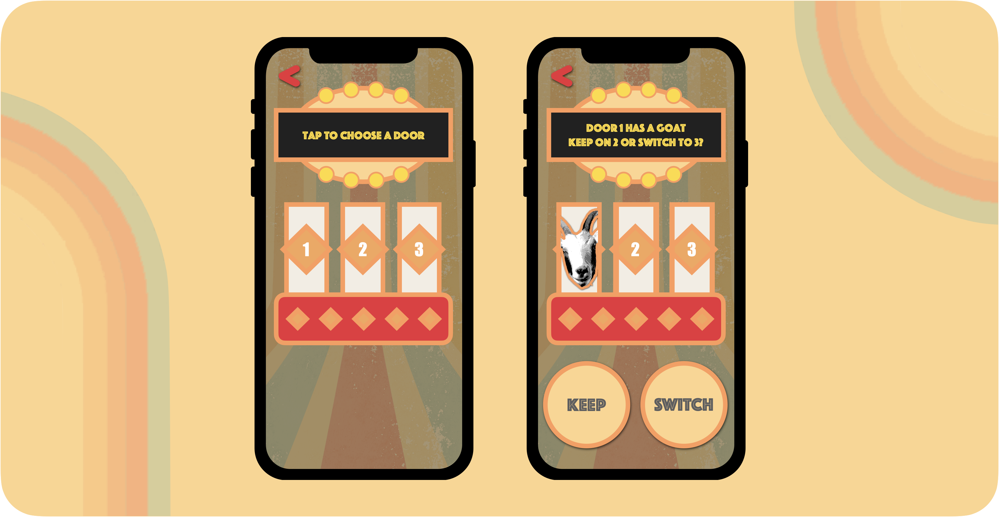

# MontyHallProblem

## Welcome to the 70s! 🕺

That is a charmful decade with many colors patterns, disco music, and other cultural expressions that we refer to as vintage.

In this era, game shows were on their peaks. One of the most famous was Let's Make a Deal, presented by the emblematic Monty Hall. 

On this show, there was a game with three doors. Two had goats behind them, and only one had a car. The contestant had to choose a door. Then Monty opened another, showing a Goat. Finally, the player had to decide to keep the first choice or switch to the other closed door.

What would you do?

This problem became a legend in mathematics, becoming a reason for countless discussions and probably some broken friendships. But now, you will understand for once and for all what to do.
